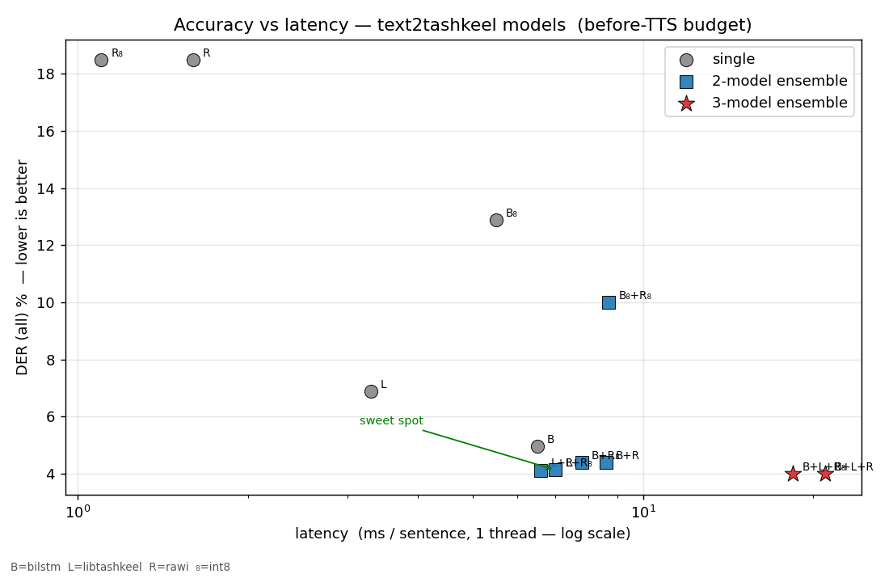
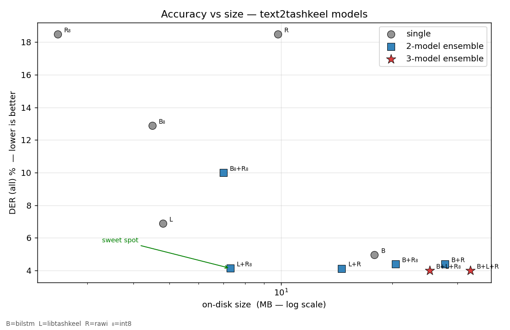
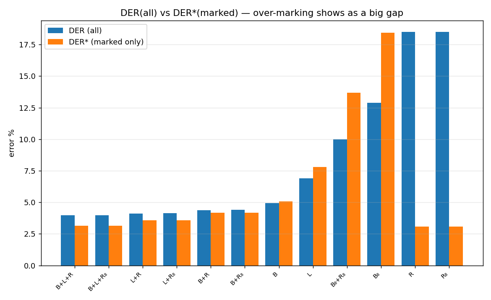
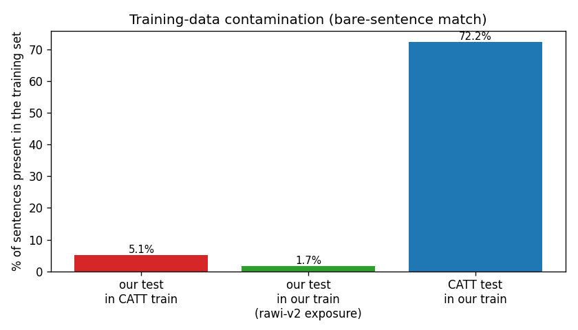

# 10. Full benchmark report

Every bundled model and gated combination is scored on the entire held-out
test split (817,035 sentences, about 49 million characters, of
[`TigreGotico/arabic_diacritized_text`](https://huggingface.co/datasets/TigreGotico/arabic_diacritized_text)),
with accuracy, latency, and size side by side. Reproduce with
[`benchmarks/run_all_combos.py`](../benchmarks/run_all_combos.py) (DER) and
[`benchmarks/generate_plots.py`](../benchmarks/generate_plots.py) (plots).

Read [§8.2](08-models-and-benchmarks.md#82-the-contamination-caveat-read-this-before-the-numbers)
first. The corpus overlaps the models' training data, so absolute DER is
optimistic. The relative picture below, the Pareto frontier, is the
dependable part.

## 10.1 The table

DER/DER\*/WER are full-split. Latency is single-thread milliseconds per
sentence on about 58-character input, and scales roughly linearly with
cores. Size is on-disk ONNX.

| Model | DER ↓ | DER\* ↓ | WER ↓ | latency ↓ | size |
|-------|------:|-------:|------:|----------:|-----:|
| `rawi-v2+rawi-v3` | 2.03% | 2.93% | 7.47% | ~2 ms | 19.5 MB |
| `rawi-v2-int8+rawi-v3-int8` | 2.04% | 2.94% | 7.51% | ~2 ms | 4.9 MB |
| `rawi-v2+rawi` | 2.19% | 3.20% | 8.02% | ~2 ms | 19.5 MB |
| `rawi-v2-int8+rawi-int8` | 2.20% | 3.21% | 8.04% | ~2 ms | 5.0 MB |
| `rawi-v2+rawi-int8` | 2.20% | 3.21% | 8.04% | ~2 ms | 12.2 MB |
| `rawi-v2` | 2.29% | 3.37% | 8.33% | ~1 ms | 9.7 MB |
| `rawi-v2-int8` | 2.30% | 3.39% | 8.36% | ~1 ms | 2.5 MB |
| `rawi-v3-int8` | 3.04% | 2.93% | 11.89% | ~1 ms | 2.5 MB |
| `rawi-v3` | 3.07% | 2.92% | 12.06% | ~1 ms | 9.8 MB |
| `bilstm+libtashkeel+rawi` | 3.99% | 3.13% | 15.79% | 21 ms | 32.5 MB |
| `bilstm+libtashkeel+rawi-int8` | 3.99% | 3.14% | 15.80% | 18 ms | 25.2 MB |
| `libtashkeel+rawi` | 4.12% | 3.59% | 16.22% | 6.6 ms | 14.6 MB |
| `libtashkeel+rawi-int8` | 4.13% | 3.59% | 16.23% | 7.0 ms | 7.3 MB |
| `bilstm+rawi` | 4.38% | 4.17% | 16.72% | 8.6 ms | 27.7 MB |
| `bilstm+rawi-int8` | 4.39% | 4.17% | 16.73% | 7.8 ms | 20.4 MB |
| `bilstm` | 4.95% | 5.08% | 18.02% | 6.5 ms | 17.9 MB |
| `libtashkeel` | 6.89% | 7.80% | 24.56% | 3.3 ms | 4.8 MB |
| `bilstm-int8+rawi-int8` | 10.00% | 13.68% | 30.11% | 8.7 ms | 7.0 MB |
| `bilstm-int8` | 12.89% | 18.42% | 37.54% | 5.5 ms | 4.5 MB |
| `rawi` | 18.49% | 3.07% | 55.48% | 1.6 ms | 9.8 MB |
| `rawi-int8` | 18.49% | 3.08% | 55.47% | 1.1 ms | 2.5 MB |

`rawi-v2-int8` is the default single model. The flagship is
`rawi-v2-int8+rawi-v3-int8` (2.04%, 4.9 MB): rawi-v2 gates where, and
rawi-v3's value head supplies which (its DER\* of 2.93% is the best of any
single model). Because v2 and v3 share a vocabulary, it ships as a single
stitched ONNX
([`tools/build_ensemble_v2v3_onnx.py`](../tools/build_ensemble_v2v3_onnx.py),
HF `TigreGotico/rawi-ensemble`). `rawi-v2-int8` is the leaner standalone
pick (2.30%, about 1 ms, 2.5 MB), a plain BiLSTM with no attention, so
INT8 quantization is lossless. `rawi-v3` alone (the two-head model) has the
best DER\* (2.92%) of any model, since its value head is the best
which-mark predictor, but its presence head underperforms the explicit
gate, so its overall DER and WER trail rawi-v2
([§9.6](09-combining-models.md#96-the-rawi-family-and-the-flagship)).
`rawi`/`rawi-int8` are value models with very low DER\* (about 3%) and high
DER (about 18%) because of a one-line training bug that never teaches them
to abstain ([§9.3](09-combining-models.md#93-why-rawi-v1-over-marks)). They
are used as value components in ensembles. This is the full
817,035-sentence test split. Raw output is in
[`benchmarks/`](../benchmarks/) (`results_rawi_v2_fulltest.txt`,
`results_v2_gate_fulltest.txt`, `results_v3_fulltest.txt`).

## 10.2 Accuracy vs latency: the before-TTS budget

Diacritization runs before TTS in a voice pipeline, so its latency adds to
the user-perceived response. On the Pareto frontier:

- `rawi-v2-int8` has the best accuracy among single models (2.30%), the
  fastest speed (about 1 ms), and the smallest size (2.5 MB). There is no
  trade-off to make here. It is simultaneously the most accurate and the
  cheapest point among standalone models. `rawi-v2` (fp32) has identical
  accuracy at 9.7 MB.
- Other available options sit lower on the accuracy axis:
  - `libtashkeel+rawi-int8`: 4.13% at 7 ms and 7.3 MB.
  - `bilstm+libtashkeel+rawi`: 3.99%, but 21 ms and 32 MB.
  - `bilstm` alone: 6.5 ms, 4.95%, a low-complexity floor.
  - `rawi`/`rawi-int8`: fastest but high DER (18%) when used alone,
    designed as ensemble value models.

All ensemble latencies are post-[optimization](09-combining-models.md): the
gates return their mark-mask from argmax directly, about 4 to 6 times
faster than re-decoding, with byte-identical output.

## 10.3 Accuracy vs size

`libtashkeel+rawi-int8` sits on the frontier at this size point: 7.3 MB for
4.13% DER. The INT8 value model (`rawi-int8`, lossless) is what shrinks the
ensembles. See
[§8.4](08-models-and-benchmarks.md#quantization-is-architecture-dependent).

## 10.4 The over-marking and under-marking diagnostic

The gap between DER (all positions) and DER\* (marked positions only)
fingerprints how a model is wrong:

- `rawi`/`rawi-int8`: a tiny DER\* (about 2.7%) with a huge DER (about
  18%). They nail the marks but over-mark. See
  [§9.3](09-combining-models.md#93-why-rawi-v1-over-marks) for the
  one-line training bug behind it.
- `bilstm-int8`, `bilstm-int8+rawi-int8`: DER\* worse than DER. A degraded
  gate under-marks or mis-marks the hard positions. Quantizing the gate
  hurts. Quantizing the value (`rawi-int8`) is free.
- The well-balanced ensembles: DER is close to DER\*, and both are low, so
  there is no systematic bias.

## 10.5 External comparison: CATT, and why cross-corpus DER is slippery

[CATT](https://github.com/abjadai/catt) is a 2024 character-transformer
diacritizer, a reasonable high-capacity reference. It was exported to ONNX
and benchmarked both ways: on the broad test split, and on CATT's own test
split, with one shared per-Arabic-letter metric (CATT drops non-Arabic
characters, so all models are scored on Arabic letters only). The result is
a clean illustration that a single DER number means little without saying
whose distribution it is on.

### On this project's test split (the broad aggregate)

| model | DER (all) | DER\* (marked) | scope |
|------|----------:|---------------:|-------|
| `rawi-v2` | 2.29% | 3.37% | full 817k |
| CATT-EO (encoder-only) | 4.27% | 2.49% | full 817k |
| CATT-ED (encoder-decoder) | 4.23% | 2.46% | 10k sample¹ |

### On CATT's own test split (2,500 sentences, narrow/classical)

| model | DER, full (2168) | DER, rawi-clean (591)² |
|------|------------------:|------------------------:|
| CATT-EO | 0.39% | 0.35% |
| `bilstm` | 1.84% | 1.85% |
| `rawi-v2` | 3.11% | 3.03% |
| `libtashkeel` | 7.11% | 7.10% |

Each model is strongest on its own training distribution, by a wide
margin: rawi-v2 leads on the broad aggregate (2.29% vs CATT's 4.27%), and
CATT is near-perfect on its narrower classical test (0.35% vs rawi-v2's
3.03%). The "fair-set" filtering removes rawi-v2's exposure but cannot
remove CATT's distribution advantage on its own turf. So neither number is
a clean verdict. They measure fit to different data.

### Measured overlap

Matching on the bare (undiacritized) sentence across corpora:

| overlap | value | meaning |
|---|---:|---|
| our test in CATT train | 5.1% | CATT saw about 5% of our benchmark sentences |
| our test in our train | 1.7% | rawi-v2 saw about 3 times fewer (near-dup aggregation) |
| CATT test in our train | 72.2% | so a raw rawi-v2 run on CATT's test needs filtering |
| CATT test in CATT train | 2.5% | CATT's test is genuinely held out |

### But bare-sentence overlap is not label memorization

The decisive evidence: rawi-v2 scores 3.11% on CATT's full test (72%
"seen") and 3.03% on the rawi-clean subset (0% seen), essentially
identical. If the overlap were real leakage, the "seen" set would be far
easier. It is not, because the same bare sentence is diacritized
differently across sources. rawi-v2 learned this corpus's vocalization
convention, CATT's gold uses another, so a shared skeleton confers no
advantage. That cuts both ways: it also weakens the "CATT trained on 5% of
our test" worry. Distribution match, not sentence contamination, dominates
DER here. (`bilstm`, Tashkeela-trained like CATT's likely source,
generalizes best of these models to CATT's test at 1.85%, the same story
from the other side.)

### Takeaway

There is no clean cross-corpus winner. The honest, defensible claim is
that `rawi-v2` is the strongest model on the broad aggregate corpus and
remains competitive out of distribution, not that it beats CATT in
general. A genuinely neutral comparison would need a test set that is
neither model's home turf, scored with one convention. That is an open
problem that a filtered home-test cannot settle.

¹ CATT-ED's released decoder has no KV cache (O(L²)), so full-test is
infeasible (about 76 hours on GPU), hence a 10k sample. It barely edges EO
(4.23 vs 4.27%).
² rawi-clean is CATT's test minus any sentence whose bare form is in
rawi-v2's training data (72% removed). On the remainder, rawi-v2 has 0%
exposure and CATT 2.3%. WER is omitted for CATT, because its ONNX output
does not preserve word spacing, so word-level alignment (not letter-level
DER) is unreliable for it. CATT-EO also quantizes cleanly (78 to 21.6 MB
int8, +0.03% DER). Reproduce with
[`benchmarks/catt_overlap.py`](../benchmarks/catt_overlap.py) and
[`benchmarks/filter_catt_test.py`](../benchmarks/filter_catt_test.py).

## 10.6 Bottom line

| If you want... | use |
|--------------|-----|
| default, flagship | `rawi-ensemble` (2.04%, about 2 ms, 4.9 MB): v2 gates, v3 values, one stitched ONNX |
| leaner single model | `rawi-v2-int8` (2.30%, about 1 ms, 2.5 MB) |
| a non-V2 single model | `bilstm` (4.95%, 6.5 ms) |
| the old ensemble frontier | `libtashkeel+rawi-int8` (4.13%) / `bilstm+libtashkeel+rawi` (3.99%) |

---
[← Combining models](09-combining-models.md) · [Home](index.md) · [Next →](11-what-makes-rawi-different.md)
